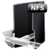

# Cluster Template Downloads

Azure CycleCloud comes with built-in cluster templates that you can use out of the box, or customize to [build a template](cluster-templates.md) for your specific needs. For the full list of available cluster templates, please visit [Microsoft Azure GitHub](https://github.com/Azure?utf8=%E2%9C%93&q=cyclecloud&type=&language=) and search for "cyclecloud".

Once your custom template is complete, you can import it into your CycleCloud instance with:

```azurecli-interactive
cyclecloud import_template -f templates/template-name.template.txt
```

## Available Template Types

| Project/Template Type                                    | CycleCloud Repo                                             | Description                                                                                                                                                          |     |
| -------------------------------------------------------- | ---------------------------------------------------------------------------- | -------------------------------------------------------------------------------------------------------------------------------------------------------------------- | --- |
| [](https://blender.org)                 | [Blender](https://github.com/Azure/cyclecloud-blender)                       | CycleCloud project. Installs and configures Blender 3D Rendering toolkit for batch rendering; includes example cluster template that installs Blender alongside SGE. |     |
| [](https://www.beegfs.io/content/)                   | [BeeGFS](https://github.com/Azure/cyclecloud-beegfs)                         | CycleCloud project to enable configuration, orchestration, and management of BeeGFS file systems in Azure CycleCloud HPC clusters.                                   |     |
| [](https://anaconda.org/anaconda/conda)                     | [Conda](https://github.com/Azure/cyclecloud-conda)                           | CycleCloud project to enable use of conda/bioconda/miniconda on Azure CycleCloud HPC clusters.                                                                       |     |
| [](https://azure.microsoft.com/en-ca/services/virtual-machines/data-science-virtual-machines/) | [Azure Data Science VM](https://github.com/Azure/cyclecloud-data-science-vm) | CycleCloud project to enable running the Azure Data Science VM Marketplace offering instance.                                                                        |     |
| [](https://docker.com)                   | [Docker](https://github.com/Azure/cyclecloud-docker)                         | CycleCloud project to enable use of Docker containers in HPC clusters. Differs from running CycleCloud in a container instance.                                      |     |
| [](https://docs.gluster.org/en/latest/)                 | [Gluster](https://github.com/Azure/cyclecloud-gluster)                       | Enables users to provision Gluster file systems as part of HPC clusters in Azure.                                                                                    |     |
| [](http://gridscheduler.sourceforge.net/)         | [Grid Engine](https://github.com/Azure/cyclecloud-gridengine)                | Azure CycleCloud GridEngine cluster template.                                                                                                                        |     |
| [](https://docs.microsoft.com/en-us/powershell/high-performance-computing/overview?view=hpc16-ps)                 | [HPC Pack](https://github.com/Azure/cyclecloud-hpcpack)                      | CycleCloud project that enables use of Microsoft HPC Pack job scheduler.                                                                                             |     |
| [](https://research.cs.wisc.edu/htcondor/)               | [HTCondor](https://github.com/Azure/cyclecloud-htcondor)                     | Azure CycleCloud HTCondor cluster template.                                                                                                                          |     |
| [](https://kafka.apache.org/)                     | [Kafka](https://github.com/Azure/cyclecloud-kafka)                           | CycleCloud project to configure and launch a basic Apache Kafka cluster.                                                                                             |     |
| [](https://lammps.sandia.gov/)                   | [LAMMPS](https://github.com/Azure/cyclecloud-lammps)                         | CycleCloud project for LAMMPS cluster type.                                                                                                                          |     |
| [](https://www.ibm.com/us-en/marketplace/hpc-workload-management)                 | [Spectrum LSF](https://github.com/Azure/cyclecloud-lsf)                      | CycleCloud project to enable use of Spectrum LSF job scheduler in Azure CycleCloud HPC clusters.                                                                     |     |
| [](http://mrbayes.sourceforge.net/)                | [MrBayes](https://github.com/Azure/cyclecloud-mrbayes)                       | Azure CycleCloud MrBayes cluster template.                                                                                                                           |     |
|                                                       | [Network File System](https://github.com/Azure/cyclecloud-nfs)               | CycleCloud project to enable use of NFS filers in HPC clusters in Azure.                                                                                             |     |
|                                                       | [PBS Professional OSS](https://github.com/Azure/cyclecloud-pbspro)                         | Azure CycleCloud PBSPro cluster template.                                                                                                                            |     |
| [](https://redis.io/)                                                         | [Redis](https://github.com/Azure/cyclecloud-redis)                           | CycleCloud project to configure and launch a basic Redis cluster.                                                                                                    |     |
| [](https://www.sylabs.io/)                                                      | [Singularity](https://github.com/Azure/cyclecloud-singularity)               | CycleCloud project to enable use of Singularity containers in HPC clusters in Azure.                                                                                 |     |
| [](https://slurm.schedmd.com/)                                                      | [Slurm](https://github.com/Azure/cyclecloud-slurm)                           | CycleCloud project to enable users to create, configure, and use Slurm HPC clusters.                                                                                 |     |
| [](https://www.ibm.com/ca-en/marketplace/analytics-workload-management)                                                      | [Spectrum Symphony](https://github.com/Azure/cyclecloud-symphony)            | CycleCloud project to enable use of Spectrum Symphony job scheduler in Azure CycleCloud HPC clusters.                                                                |     |
| [](https://zookeeper.apache.org/)                                                      | [ZooKeeper](https://github.com/Azure/cyclecloud-zookeeper)                   | CycleCloud project to configure and launch a basic Apache ZooKeeper cluster.                                                                                         |     |

# Contributing

This project welcomes contributions and suggestions.  Most contributions require you to agree to a
Contributor License Agreement (CLA) declaring that you have the right to, and actually do, grant us
the rights to use your contribution. For details, visit https://cla.microsoft.com.

When you submit a pull request, a CLA-bot will automatically determine whether you need to provide
a CLA and decorate the PR appropriately (e.g., label, comment). Simply follow the instructions
provided by the bot. You will only need to do this once across all repos using our CLA.

This project has adopted the [Microsoft Open Source Code of Conduct](https://opensource.microsoft.com/codeofconduct/).
For more information see the [Code of Conduct FAQ](https://opensource.microsoft.com/codeofconduct/faq/) or
contact [opencode@microsoft.com](mailto:opencode@microsoft.com) with any additional questions or comments.
